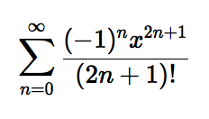

# `ktx`

`ktx` is a command-line interface for the math rendering library [KaTeX](https://katex.org), packaged as a zero-dependency executable file.

Type this:

```
$ ktx "\sum_{n=0}^\infty{\frac{(-1)^nx^{2n+1}}{(2n+1)!}}"
```

and get this:



## Installation

`ktx` supports macOS 10.13 (High Sierra) and later.

1. Head over to [Releases](https://github.com/ryanbloom/ktx/releases) and download the latest version
2. Move it to a folder that's included in your `$PATH` (for example, `/usr/local/bin`)

## Usage
```bash
# Save the result to a temporary file and open it
ktx "x^2"

# Make the font small and use inline layout mode
ktx "x^2" --size 12 --inline

# Save the result to a particular destination
ktx "x^2" output.tiff

# Save the result to a particular destination and open it
ktx "x^2" output.tiff --open
```

## Development
Make sure you have a recent version of [Xcode](https://developer.apple.com/xcode/) and [Node.js](https://nodejs.org). Then run these commands in a terminal:

```bash
$ git clone https://github.com/ryanbloom/ktx
$ cd ktx/JavaScript
$ npm install
$ ./node_modules/.bin/webpack --config=webpack.config.js
```

This will create a bundle of all the KaTeX source code and fonts at `ktx/JavaScript/dist/index.html`. You'll have to repeat the last command whenever you edit the JavaScript or HTML files.

Now, open `Ktx.xcodeproj` and build the project.